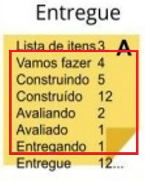
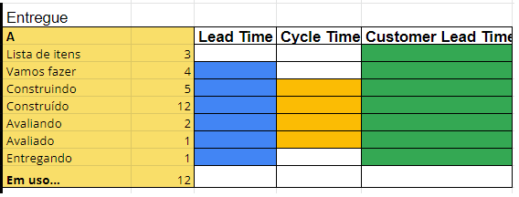
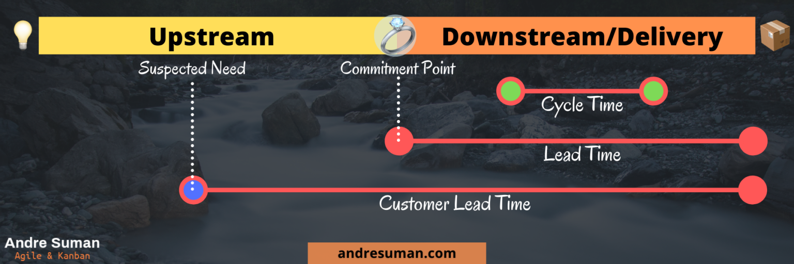

# Coding Dojo calculo Métricas Ágeis

## Sua missão caso decida aceitar

* Calcular nosso Lead Time
* Calcular nosso Cycle Time (Construção + Avaliação)

## Como calcular Lead Time

Para se calcular o Custumer Lead Time, utilizaremos a status "Entregue", pois os itens nela já se encontram finalizados. 

Os valores que constam nas colunas são os dias que cada item ficou em cada processo. 

Para calcular o Lead Time, não utilizamos olhamos para o processo "Lista de Itens", porque neste processo o item ainda não começou a ser desenvolvido e também não utilizaremos as quantidade do processo "Entregue", porque este já se encontra com o cliente. 

No exemplo dado, para se fazer o calculo, somamos os valores dos processos dos itens A, B, C e D e dividimos o total por 4. Daí teremos a media de dias para um item ficar pronto.

## Como calcular o Cycle Time

Cycle Time: É um tempo de ciclo entre quaisquer fases. Exemplo: Cycle Time de Desenvolvimento, Cycle Time de Homologação, Cycle Time de Revisão de Código. Cycle Time é avaliado entre dois pontos que você escolher.

## Links :

https://blogdocaze.com.br/2021/04/15/leadtime-cycletime-diferenca/

