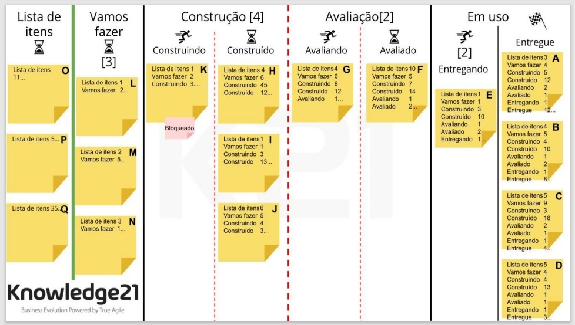
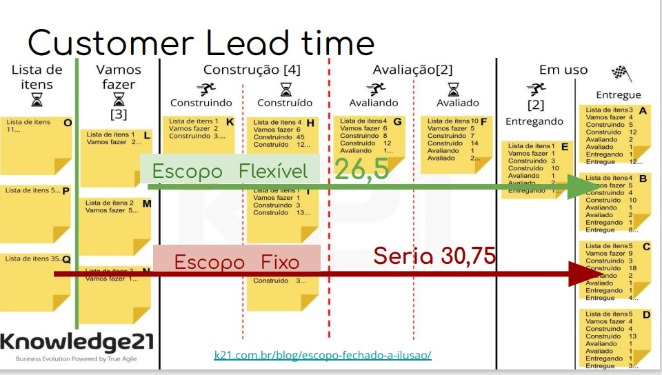

# Coding Dojo calculo Métricas Ágeis

## Sua missão caso decida aceitar

* Calcular nosso Lead Time
* Calcular nosso Cicle Time
* Calcular nosso Customer Lead Time

Para se calcular o Custumer Lead Time, utilizaremos a status "Entregue", pois os itens nela já se encontram finalizados. 

Os valores que constam nas colunas são os dias que cada item ficou em cada processo. Não utilizaremos as quantidade do status "Lista de Itens", porque neste processo o item ainda não começou a ser desenvolvido e também não utilizaremos as quantidade do processo "Em uso", porque este já se encontra com o cliente. No exemplo dado, para se fazer o calculo, somamos os valores dos processos dos itens A, B, C e D e dividimos o total por 4. Daí teremos a media de dias para um item ficar pronto.

